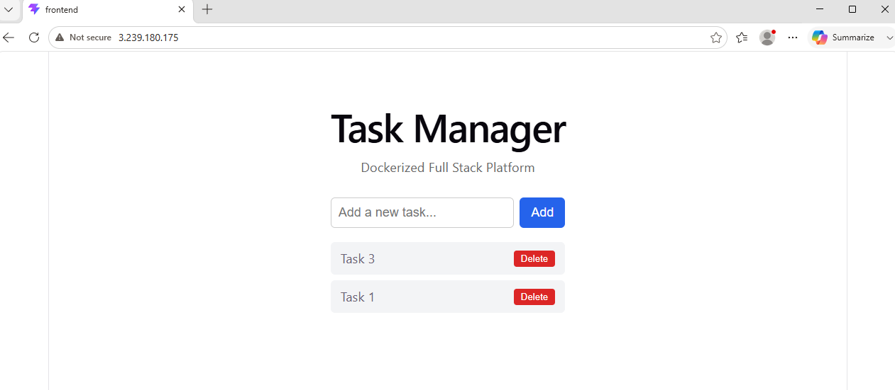
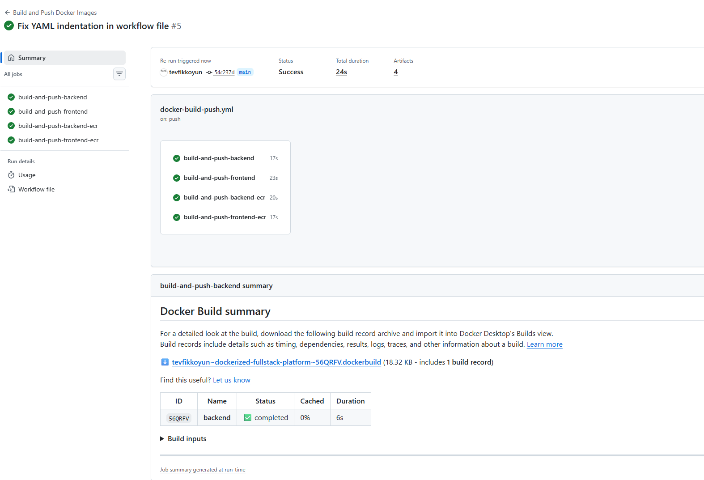
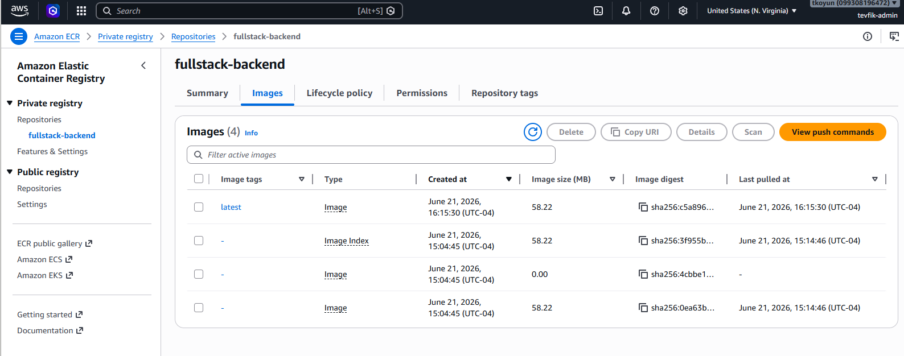
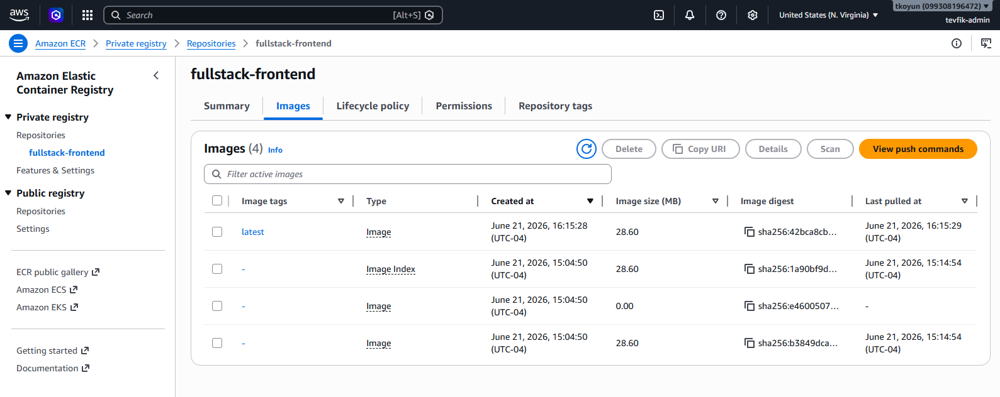

# Fullstack AWS Deployment

Deployed a Dockerized full-stack application to AWS using Terraform, ECR, EC2, Docker Compose, and GitHub Actions CI/CD.

This project takes [dockerized-fullstack-platform](https://github.com/tevfikkoyun/dockerized-fullstack-platform) — a containerized Task Manager app (React, Node.js/Express, PostgreSQL, Nginx) — and deploys it to real AWS infrastructure, provisioned entirely as code.



## Architecture

```
 Local machine                  GitHub                         AWS
┌──────────────┐         ┌──────────────────┐         ┌───────────────────────┐
│ docker build  │ ──git──▶│ GitHub Actions     │──push──▶│        ECR              │
│ docker push   │  push   │ (CI/CD pipeline)   │         │ fullstack-backend       │
└──────────────┘         └──────────────────┘         │ fullstack-frontend      │
                                                          └───────────┬───────────┘
                                                                      │ pull
                                                                      ▼
                                                          ┌───────────────────────┐
                                                          │          EC2             │
                                                          │  Docker + Compose         │
                                                          │  db · backend · frontend  │
                                                          │  · nginx (port 80)        │
                                                          └───────────────────────┘

           All infrastructure (VPC, subnet, security group, EC2, ECR, IAM role)
                          provisioned via Terraform.
```

## Stack

| Layer | Technology |
|---|---|
| Infrastructure as Code | Terraform |
| Cloud Provider | AWS |
| Networking | VPC, public subnet, internet gateway, security group |
| Compute | EC2 (Amazon Linux 2023), Docker + Docker Compose installed via `user_data` |
| Container Registry | Amazon ECR (backend + frontend repositories, scan-on-push enabled) |
| Authentication | IAM Role (EC2 → ECR, read-only) + IAM User access keys (GitHub Actions → ECR, push) |
| CI/CD | GitHub Actions — builds and pushes images to both Docker Hub and Amazon ECR in parallel |
| Application | [dockerized-fullstack-platform](https://github.com/tevfikkoyun/dockerized-fullstack-platform) |

## What Terraform provisions

- **VPC** with a public subnet and internet gateway
- **Security group** allowing HTTP (80) and SSH (22)
- **EC2 instance** (`t3.micro`, Amazon Linux 2023) — Docker and Docker Compose are installed automatically via a `user_data` startup script, no manual setup required
- **Two ECR repositories** (`fullstack-backend`, `fullstack-frontend`) with vulnerability scanning enabled on every push
- **IAM Role**, scoped to `AmazonEC2ContainerRegistryReadOnly`, attached to the EC2 instance via an instance profile — so the server can pull images from ECR without any stored credentials

## CI/CD pipeline

Every push to `main` in the application repository triggers four parallel GitHub Actions jobs — two pushing to Docker Hub, two pushing to Amazon ECR:



Images land in ECR automatically, scanned on push:




GitHub Actions authenticates to AWS using an IAM user's access keys, stored as repository secrets (`AWS_ACCESS_KEY_ID`, `AWS_SECRET_ACCESS_KEY`, `AWS_ACCOUNT_ID`) — never exposed in the workflow file or logs.

## Deploying

```bash
cd terraform
terraform init
terraform apply
```

Terraform outputs the EC2 public IP and both ECR repository URLs. From there:

```bash
# Build, tag, and push images to ECR (from local machine)
docker build -t fullstack-backend:latest ./backend
docker tag fullstack-backend:latest <account_id>.dkr.ecr.us-east-1.amazonaws.com/fullstack-backend:latest
docker push <account_id>.dkr.ecr.us-east-1.amazonaws.com/fullstack-backend:latest
# (repeat for frontend)

# On the EC2 instance: authenticate, pull, and run
aws ecr get-login-password --region us-east-1 | docker login --username AWS --password-stdin <account_id>.dkr.ecr.us-east-1.amazonaws.com
docker-compose pull
docker-compose up -d
```

Once the CI/CD pipeline is wired up (as it is in this project), the build-and-push half of this happens automatically on every `git push` — only the EC2-side pull and restart remains manual in this version.

## Tearing it down

```bash
terraform destroy
```

ECR repositories are configured with `force_delete = true`, so they tear down cleanly even with images still in them — no leftover billable resources.

## Design decisions worth noting

- **EC2 uses an IAM Role, not stored credentials, to reach ECR.** The instance authenticates via a role attached through an instance profile — no access keys live on the server itself. This came from direct experience: the first attempt at `docker login` from EC2 failed with "Unable to locate credentials," which is the expected and correct behavior before a role is attached.
- **The IAM Role is read-only** (`AmazonEC2ContainerRegistryReadOnly`) — the EC2 instance can pull images but never push or delete them, following least-privilege practice (the same principle applied to the non-root container user in the application repo's Lab 12).
- **A single public subnet, no NAT gateway or bastion host**, unlike the multi-tier VPC design used in an earlier infrastructure project ([hybrid-infra-platform](https://github.com/tevfikkoyun/hybrid-infra-platform)). This project's focus is the container deployment and CI/CD pipeline, not network segmentation — added complexity there wouldn't have served the goal.
- **SSH is open to `0.0.0.0/0`** for simplicity in this demo. A production setup would restrict this to a specific IP range or remove direct SSH access entirely in favor of AWS Systems Manager Session Manager.
- **HTTP, not HTTPS.** Without a registered domain, TLS via Let's Encrypt isn't practical for an IP-only endpoint. A production deployment would sit behind a domain name and certificate.
- **The IAM user used for GitHub Actions currently has `AdministratorAccess`**, inherited from earlier project setup. A tighter, ECR-scoped policy would be the correct production choice — noted here deliberately rather than glossed over.

## Related projects

- [dockerized-fullstack-platform](https://github.com/tevfikkoyun/dockerized-fullstack-platform) — the application deployed here
- [docker-mastery-labs](https://github.com/tevfikkoyun/docker-mastery-labs) — 12-lab Docker series this project's Docker practices build on
- [terraform-learning-labs](https://github.com/tevfikkoyun/terraform-learning-labs) — Terraform fundamentals
- [hybrid-infra-platform](https://github.com/tevfikkoyun/hybrid-infra-platform) — a more complex multi-tier AWS VPC project